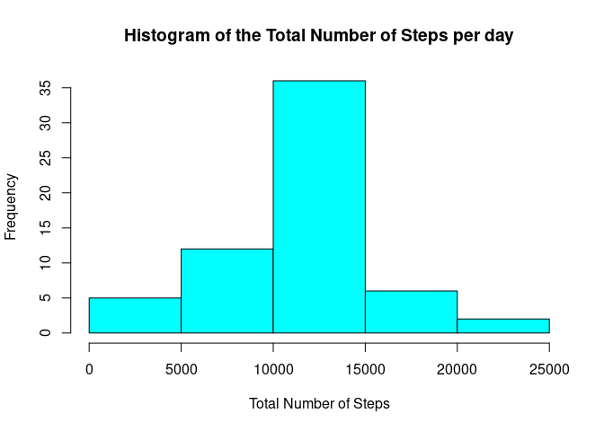
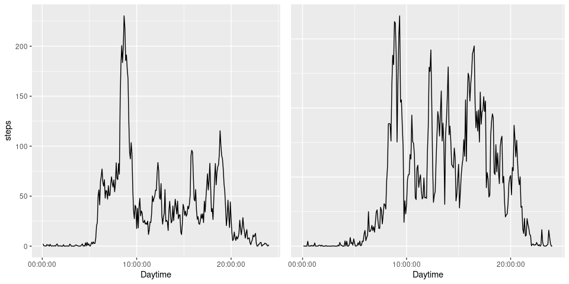

## Loading and preprocessing the data

### Decompression and Loading

The First Step to be taken in order to analyze the Data is to load it into the R environment. For this purpose, the Source files have to be uncompressed (through unzip()). After the decompression, the created .csv file is read into the environment using read.csv


```r
  unzip("./activity.zip")
  data <- read.csv("./activity.csv")
```

### Preprocessory Steps


```r
  str(data)
```

```
## 'data.frame':	17568 obs. of  3 variables:
##  $ steps   : int  NA NA NA NA NA NA NA NA NA NA ...
##  $ date    : Factor w/ 61 levels "2012-10-01","2012-10-02",..: 1 1 1 1 1 1 1 1 1 1 ...
##  $ interval: int  0 5 10 15 20 25 30 35 40 45 ...
```
The first practical Step after loading the data is to look at the structure of the Dataset. Together with the questions that the Analysis is trying to answer, one can assess adequate preprocessing steps to take. 

In this case, a lot of the questions depend on the dates. The dates in the Dataset are Strings. It would therefore make sense to first transform the values iinto R Date variables. 


```r
  data$date <- as.Date(data$date, "%Y-%m-%d")
  str(data$date)
```

```
##  Date[1:17568], format: "2012-10-01" "2012-10-01" "2012-10-01" "2012-10-01" "2012-10-01" ...
```

## What is mean total number of steps taken per day?

This chapter focuses on summarizing and visualizing the key values of the Steps taken per day. 

### Total Number of Steps per Day

The first step is to calculate the *Total Number of Steps per day* and visualize them through a histogram. For this we use the following Code making use of the group_by and summarize_at functions of the dplyr Package:


```r
  library(dplyr)
```

```
## 
## Attaching package: 'dplyr'
```

```
## The following objects are masked from 'package:stats':
## 
##     filter, lag
```

```
## The following objects are masked from 'package:base':
## 
##     intersect, setdiff, setequal, union
```

```r
  total_values <- data %>% group_by(date) %>%  summarize_at("steps", sum)
  
  hist(total_values$steps, col="cyan", xlab="Total Number of Steps", main = "Histogram of the Total Number of Steps per day")
```

<!-- -->

The Histogram shows a roughly normal distribution of Number of Steps per day. 

### Mean and Median Number of Steps per Day

The next key numbers to calculate will be the *Mean* and the *Median* Number of Steps taken per day. FOr this, the total_values calculated in the last chunk are used. For now, we are going to be removing the days that contain missing values by setting the option na.rm equal to TRUE: 


```r
  mean_steps <- mean(total_values$steps, na.rm=TRUE)
  median_steps <- median(total_values$steps, na.rm = TRUE)
```

From the Calculation we get:

- The *Mean* Number of Steps taken per day is: 10766.19 (Rounded here to two digits for readability)
- The *Median* Number of Steps taken per day is: 10765

### Visualization

To conclude the key numbers, we once again look at the Histogram of the *Total Number of Steps per day*, Adding the Mean/Median values into the graph. As Mean and Median are only off by 1 Step, we can choose one of them for the visualization. In this case we use the mean value: 


```r
  hist(total_values$steps, col="cyan", xlab="Total Number of Steps", main = "Histogram of the Total Number of Steps per day")
  abline(v = mean_steps, col="magenta", lwd=3)
  legend("topright", legend= "Mean No. Steps/Day", col="magenta" ,lty=1, lwd=3)
```

<!-- -->

## What is the average daily activity pattern?

After looking at the key numbers in the last Section, the question now becomes what underlying patterns can be found in the data. In this Section, the Average daily Activity Pattern is calculated and visualized through a time series plot

### Meaning 

The Steps in the Dataset are recorded in a 5 Minute Interval for every day. To get the average Steps of a specific time interval (e.g. The Average number of steps Taken between 05:10 and 05:15 pm ) the Average of that interval over all recorded days is taken. All averages combined can bee seen as the **Average daily Activity**.

### Calculation & Visualizing

The Average daily Activity Pattern is gathered by usage of the group_by and summarize_at functions of the dplyr package. To ensure we get a Non-NA Value for every Interval, for now we use the option na.rm equal to true. This removers the NA values from the calculation. The Calculation is done by the following Code chunk: 


```r
  interval_values <- data %>% group_by(interval) %>% summarize_at("steps", mean, na.rm=TRUE)
  head(interval_values)
```

```
## # A tibble: 6 x 2
##   interval  steps
##      <int>  <dbl>
## 1        0 1.72  
## 2        5 0.340 
## 3       10 0.132 
## 4       15 0.151 
## 5       20 0.0755
## 6       25 2.09
```

To see what the resulting Data Frame looks like, the *head()* function displays the first 6 rows of the set. 

The Data Frame can now be used to create the Time Series Plot. The plot can be created by the following: 


```r
  library(ggplot2)
  library(hms)
  
  p <- ggplot(interval_values, aes(x= hms(minutes = which(interval == interval) * 5), y=steps)
              ) + geom_line() + xlab("Daytime")
                                   
  p
```

<!-- -->

Looking at the graph, the highest spike seems to occur on average at around 3pm. To confirm this, we calculate the maximum of the Interval averages: 


```r
  max_interval <- interval_values$interval[ interval_values$steps == max(interval_values$steps)]
  max_interval
```

```
## [1] 835
```

The calculation confirms the observation with the highest average activity interval being at 835

## Imputing missing values

To better deal with the missing values than simply ignoring them, this section describes a simple strategy for imputing the missing values. 

### Number of missing Values

To get a bit of insight into how large the effect of missing values on the observations is, we will first calculate how many rows with missing values the dataset contains. We do this with the following expression: 


```r
  sum(apply(data, 1, anyNA))
```

```
## [1] 2304
```

We see that the number of missing values is 2304. Given a total value of 17568 observations in the dataset, this means that over 10% of the observations contain missing values. As this could be make a signiificant difference, in the following we will come up with and apply a strategy to impute the missing value with an educated guess. 

### Strategy 

There are clear differences in average activity depending on the time (this was visualized in the Activity Pattern section above). Therefore, simply taking the mean/median step value of the day and use it for the missing values might lead to strongly misleading values. 

Instead, the median value of the interval of the respective missing observation will be used. This is more in line with the patterns observed so far. 

This is how the process of replacing the missing values is done: 


```r
  # first we get all rows that have missing values
  naRows <- data[apply(data, 1, anyNA), ]

  # for each row, we take the interval and apply an anonymous function to it, that returns the steps of the interval_values   # data frame, which contains the mean values of the intervals, where the interval equals the the interval of the row.
  naRows$steps <- sapply(naRows$interval, FUN = function(x) interval_values$steps[interval_values$interval == x])
  
  # the imputed values now get merged back into the data set, freeing it of all NAS
  data[apply(data, 1, anyNA), ] <- naRows
```

if we now check again for NAs, we will see that there are 0 left:


```r
  sum(apply(data, 1, anyNA))
```

```
## [1] 0
```

### Changes in properties after imputing the missing values 

after imputing the missing values in the data set, it will be good to check in which way the properties of the data changed, if at all. 

For this, we once more create a histogram of the total number of steps per day, this time using the cleaned data set. 
We use the following code to create the graph: 


```r
   library(dplyr)
  total_values <- data %>% group_by(date) %>%  summarize_at("steps", sum)
  hist(total_values$steps, col="cyan", xlab="Total Number of Steps", main = "Histogram of the Total Number of Steps per day")
```

<!-- -->

Additionally, we also calculate the mean and median values after the imputing:


```r
  total_steps <- data %>% group_by(date) %>%  summarize_at("steps", sum)

  mean_steps <- mean(total_steps$steps)
  median_steps <- median(total_steps$steps)
```

The new values are:

- median 10766.19, rounded to 2 digits
- mean 10766.19, rounded to 2 digits

Both the mean and the median value are now exactly equal to the mean value before imputing the missing values. The distribution of the frequency of total steps also equals roughly the bell shape we had before imputing, meaning that the imputing didnt introduce any drastic or unexpected changes to the dataset that would require further, deeper investigation.

## Are there differences in activity patterns between weekdays and weekends?

Lastly, we want to answer the question whether there is a difference in activity patterns between weekdays and weekends. 

### Grouping Observations into Weekday/Weekend

In order to do this, we first calculate the day of the week for each entry in the data set by using the weekdays() function. Afterwards, the data set will get an extra column indicating if the observation was on a weekday or the weekend. To achieve this we use the following r code chunk:


```r
  #making sure the system locale is set to English format for Dates
  locale <- Sys.setlocale("LC_TIME", "C")  
   
  # string vectors that express which days are weekdays and which weekend days
  weekday_as_string_set <- c("Monday", "Tuesday", "Wednesday", "Thursday", "Friday")
  weekend_as_string_set <- c("Saturday", "Sunday")
  
  # create a new column that contains the weekday of the observation
  data$day <- factor(weekdays(data$date))
  
  # combining the current levels in the created factor column into a weekday and a weekend column
  levels(data$day) <- list("weekday" = weekday_as_string_set, "weekend" = weekend_as_string_set)
  
  print(table(data$day))
```

```
## 
## weekday weekend 
##   12960    4608
```

Printing the created Factor column tells us that we have 12960 observations from weekdays and 4608 observations from weekends.

### Activity Patterns Visualized 

Now that it is known which observations belong to weekdays and which to weekends, it is possible to calculate and visualize the respective activity patterns. The data will be visualized using a plot panel of time series plots, the first of which shows the weekday activity pattern while the second displays the activity pattern for weekends:


```r
  # attach ggplot2 package to draw the panels 
  library(ggplot2)
  library(gridExtra)
```

```
## 
## Attaching package: 'gridExtra'
```

```
## The following object is masked from 'package:dplyr':
## 
##     combine
```

```r
  # the data gets split into two subsets, one for weekdays and one for weekends
  split_data <- split(data, data$day)
  
  # the split data gets used to calculate the respective average values for each interval
  average_values_weekday <- split_data$weekday %>% group_by(day, interval) %>% summarize_at("steps", mean, na.rm=TRUE)
  average_values_weekend <- split_data$weekend %>% group_by(day, interval) %>% summarize_at("steps", mean, na.rm=TRUE)
  
  # create a time series plot for each
  weekday_plot <- ggplot(average_values_weekday, aes(x= hms(minutes = which(interval == interval) * 5), y=steps)
              ) + geom_line() + xlab("Daytime")
  
  weekend_plot <- ggplot(average_values_weekend, aes(x= hms(minutes = which(interval == interval) * 5), y=steps)
              ) + geom_line() + xlab("Daytime") + theme(axis.title.y=element_blank(),
        axis.text.y=element_blank(),
        axis.ticks.y=element_blank())
  
  grid.arrange(weekday_plot, weekend_plot, nrow= 1, widths=c(5,5))
```

<!-- -->


The comparison of the graphs show, that while the general trend/pattern of activity is similar for weekend and weekday, the activity between 10:00 and about 18:00 seems to be almost linearly scaled up by a factor C which in general seems to be about 2. Meaning, that when on weekdays the average number of steps at the intervals around 12:00 is about 90 steps, this is amplified by a factor of about 2 on weekends, the graph shows a value of about 180-190 steps. Outside of this 10:00 - 18:00 interval the step averages are roughly equal.
